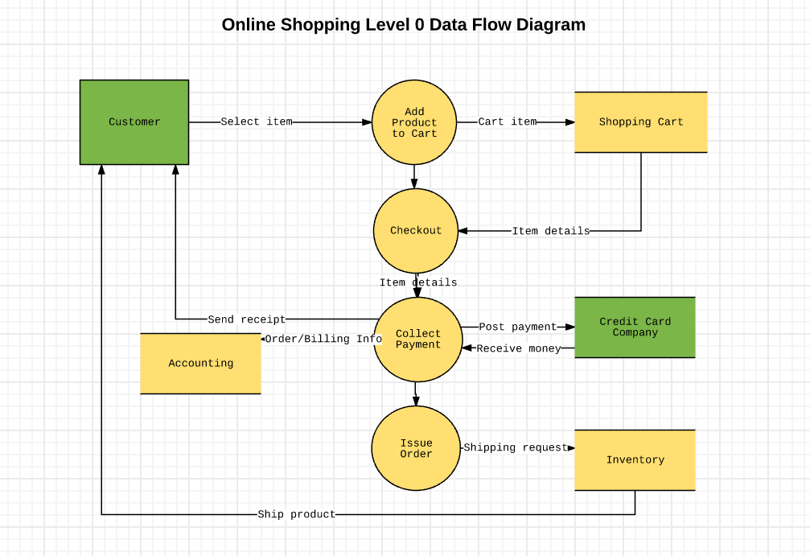

# 정보처리기사 필기

## 소프트웨어 설계

---

요구사항 명세

---

- 정형 → 수학적 원리와 표기법 사용, 알아보기 어려우나 간결하고 일관
- 비정형 → 다이어그램 표기법 사용, 알아보기 쉬우나 일관성 떨어

### 코드

---

- 순차코드
  - 코드화 대상 항목을 어떤 일정한 배열로 일련 번호를 배당하는 코드로서 항목 수가 적고 장래에 다시 작성하는 일이 없는 항목에 적합한 코드
  - 발생 순서대로 코드 부여시 확장성이 좋음
  - 단순하고 이해하기 쉬움
  - ex) 교실 입장 순서대로 번호(코드) 붙이기
- 표의 숫자 코드
  - 코드화 대상 항목의 중량, 면적, 용량 등의 물리적 수치를 이용하여 만든 코드

### **DFD(데이터 흐름도)**

---

- **프로세스(Process)**
  - **동그라미**
  - 자료를 변환시키는 처리 과정 하나를 나타냄
  - 처리/기능/변환 버블이라고도 함
- **자료 흐름(Flow)**
  - **화살표**
  - 자료의 이동을 나타냄
- **자료 저장소(Data Store)**
  - **평행선**(아래위만 선이 그어진 사각형)
  - 파일, 데이터베이스 등 자료가 저장되는 곳을 나타냄
- **단말(Terminator)**
  - **사각형**
  - 시스템과 교신하는 외부 개체
  - 데이터의 입출력 주체(사용자 등)



### 플랫폼의 성능 평가 기준

---

- 가용성
- 응답/반응 시간
- 정확성
- 사용

### UML

---

- 기본 구성 요소 → 사물(things), 관계(relationship), 다이어그램(diagram)

스테레오 타입 객체 기호 → << >>

- 구조 다이어그램
  - 클래스
  - 객체
  - 복합체 구조
  - 배치
  - 컴포넌트
  - 패키지
- 행위(순차) 다이어그램
  - 활동
  - 상태
  - 유스케이스
  - 상호작용
  - 커뮤니케이션
  - 시퀸스
    - 구성항목 → 객체, 생명선, 실행, 메시지, 시간

### GOF 디자인 패턴

---

생성

- Builder
- Prototype
- singleton
- abstract factory

구조

- Bridge
- Adapter
- Proxy

행위

- Visitor
- command
- observer
- state

### 자료 사전(Data dictionary)

---

- = → is composed of 정의
- - → and 연결
- () → optional 생략가능
- {} → iteration 반복
- [] → selection 선택
- |→ seperator 분리
- \*\*→ comment 주석

### TP-Monitor(Transaction Processing Monitor)

---

- 항공기나 철도 예약 업무 등과 같은 온라인 트랜잭션 업무에서 트랜잭션을 처리 및 감시하는 미들웨어
- 사용자 수가 증가해도 빠른 응답 속도를 유지해야 하는 업무에 주로 사용
- tuxedo(오라클), tmax(티맥스소프트)

### eXtreme Programming(XP방법론)

---

- 용기
- 존중
- 의사소통
- 피드백
- 단순성

### 객체지향 분석 절차

---

- **럼바우**
  - 객체 모델링
    - 시스템에서 객체 찾아서 분석
  - 동적 모델링
    - 시간의 흐름에 따른 객체들 사이의 제어 흐름, 상호 작용 등의 동적 행위
  - 기능 모델링
    - 자료 흐름도(DFD)를 이용
    - 흐름 중심으로 프로세스 분석
- **Coad와 Yourdon**
  - E-R 다이어그램 사용
  - 객체 식별, 구조 식별, 주제 정의, 속성과 인스턴스 연결 정의
  - 연산과 메시지 연결 정의 등의 과정

### 객체지향

---

- 일반화
  - 공통 묶고 특수 따로 분리
- 추상화
  - 현실 물체의 중요한 측면 강조
- 캡슐화
  - 객체의 자료와 행위를 하나로 묶고 ,실제 구현 내용은 외부에 감추는 것
- 집단화
  - 서로 관련 있는 여러 개의 객체를 묶어 한 개의 상위 객체를 만드는 것

### CASE(computer aided software engineering)

---

소프트웨어 공학의 여러 작업들을 자동화하는 도구

- S/W 라이프 사이클 전 단계의 연결
- 모델들 사이의 모순 검사
- 모델의 오류 검증
- 자료흐름도 등 다이어그램 작성
- 다양한 소프트웨어 개발 모형 지원
- 시스템 문서화 및 명세화를 위한 그래픽 지원

### HIPO(hierarchy input process output)

---

- 하향식 소프트웨어 개발을 위한 문서화 도구
- 차트종류: 가시적 도표, 총체적 도표, 세부적 도표
- 기능과 자료의 의존 관계 동시 표현 가능
- 가독성 좋다.

### 미들웨어

---

- 개념 → 컴퓨터와 컴퓨터 간의 연결을 쉽고 안전하게 할 수 있도록 도와주고 이에 대한 관리를 도와주는 소프트웨어
- 종류
  - Data Base (DB)
  - RPC (Remote Procedure Call) / 원격 프로시저 호출
  - MOM (Message Oriented Middleware) / 메시지 지향 미들웨어
    - 독립적인 애플리케이션을 하나의 통합된 시스템으로 묶기 위한 역할
    - 송신측과 수신측의 연결 시 메시지 큐를 활용하는 방법이 있다.
    - 상이한 애플리케이션 간 통신을 비동기 방식으로 지원한다.
  - ORB (Object Request Broker) / 객체 요청 브로커
  - WAS (Web Application Server) / 웹 어플리케이션 서버IBM의 WebSphere, 오라클의 WebLogic

### 컴포넌트 설계

---

- 협약(contract)에 의한 설계
  - 컴포넌트의 오퍼레이션 사용 전에 참이 되어야 할 선행조건
  - 사용 후 만족되어야 할 결과조건
  - 오퍼레이션이 실행되는 동안 항상 만족 되어야 할 불변조건 등이 포함되어야 한다.

### 설계 검토

---

- 동료검토 → 작성자가 설명, 동료가 들으면서 검토
- 인스펙션 → 검토 전문가들이 확인
- 워크스루 → 사전검토
- 프로토타이핑 → 프로토타입 만들어 검토
- 테스트 설계 → 테스트 케이스 가능한지 검토

### 사용자 인터페이스

---

- CLI(커맨드 라인 인터페이스) : 텍스트를 기반으로 키보드 입력을 통해 제어하는 방식
- GUI(그래픽 유저 인터페이스) : 그래픽 요소를 마우스 클릭을 통해 제어하는 방식
- NUI(내츄럴 유저 인터페이스) : 특별히 사용법을 익히지 않아도, 사람의 자연스러운 말이나 표정이나 생체 정보를 이용해서 시스템을 제어하는 방식
- OUI(오가닉 유저 인터페이스) : 인간이 자연스러운 방식으로 제어할 수 있도록 하는 방식

### FEP

---

- 입력되는 데이터를 커퓨터의 프로세서가 처리하기 전에 미리 처리하여 프로세서가 처리하는 시간을 줄여주는 프로글매이나 하드웨어를 말하는 것

## 소프트웨어 개발

---

### 정렬

---

- 선택정렬
  - O(n^2)
- 삽입정렬
  - O(n^2)
- 버블정렬
  - O(n^2)
- 퀵정렬
  - O(nlogn)
- 합병정렬
  - O(nlogn)

### 테스트 종류

---

- 테스트 케이스: 구현된 소프트웨어가 사용자의 요구사항을 정확하게 준수했는지 확인하기 위해 구성된 테스트 명세서
- 테스트 시나리오: 테스트 케이스들을 적용하는 구체적인 절차를 명세한 문서
- 테스트 오라클: 결과를 판단하기 위해 테스트 케이스에 대한 예상 결과를 학인하는 활동

### 단위 테스트

---

- white box testing
  - 모듈 안의 작동을 직접 관찰 가능
  - 산출물의 각 기능별로 적절한 프로그램의 제어구조에 따라 선택, 반복문 수행 가능
  - base path testing(기초 경로 테스트), roop test(루프 테스트), data flow test(데이터 흐름 테스트), condition coverage(조건 커버리지)
- black box testing
  - boundary value analysis(경계값 분석), 동등 분할, 오류 예측, 원인 결과 그래프, 비교 테스트

### 인터페이스 구현 검증도구

---

- STAF → 서비스 호출, 컴포넌트 재사용 등 다양한 환경을 지원하는 테스트 프레임워크, 각 테스트 대상 분산 환경에 데몬을 사용하여 테스트 대상 프로그램을 통해 테스트를 수행하고, 통합하여 자동화하는 검증 도구
- XUnit: 다양한 언어를 지원하는 단위테스트 프레임워크
  - Cppunit, JUnit, HttpUnit
- FitNesse: 웹 기반 테스트 케이스 설계, 실행, 결고 확인 등을 지원하는 테스트 프레임워크
- NTAF: FitNesse의 장점인 협업 기능과 STA의 장점인 재사용 및 확장서을 통합한 테스트 자동화 프레임워크

### EAI(Enterprise Application Integration, 기업 애플리케이션 통합)

---

- 엔터프라이즈의 미들웨어를 인프라로 하여 다양한 이질적 기업환경을 통합하여 하나의 시스템으로 관리 운영할 수 있는 유기적인 시스템
- 구축 유형
  - point to point
  - Hub & spoke
  - messaging Bus
  - Hybrid

### 인터페이스 보안

---

- IPSec
- SSL
- S-HTTP

### 반정규화

---

- 테이블 합병 → join없이 하나의 테이블로 관리 가능
- 중복 칼럼 추가 → 게시판 테이블에 회원 정보를 일부 저장한다. join 필없음
- 계산된 칼럼 추가 → 평균치, 계량값을 특정 필드에 추가한다. 자주 참조되는 값이면 그냥 필드에 추가
- 코드 명칭 칼럼 추가 → 남자, 여자를 M,F가 아니라 그냥 남자 여자로 저장

### 국제 표준

---

- **ISO/IEC 9126 품질 특성**
  - 기능성 : 적합성, 정확성, 상호 운용성, 보안성
  - 신뢰성 : 성숙성, 결함 허용성, 회복성
  - 사용성 : 이해성, 학습성, 운용성, 친밀성
  - 효율성 : 시간 반응성, 자원 효율성
  - 유지보수성 : 분석성, 변경성, 안정성, 시험성
  - 이식성 : 적응성, 설치성, 공존성, 대체성
- **ISO/IEC 12119 품질 특성**
  - 패키지 소프트웨어의 일반적인 제품 품질 요구사항 및 테스트를 위한 국제표준

### 트리

---

- 차수 → 노드에 파생된 차수가 가장 많은 차수의 개수
- 단말노드 → 차수가 없는 노드

### McCabe의 cyclomatic

---

- 화살표 - 노드 수 +2

### DRM(디지털 저작권 관리)의 기술 요소

---

- 암호화 기술, 암호화 파일 생성
- 키 관리, 식별 기술
- 저작권 표현, 정책 관리
- 크랙 방지, 인증, 인터페이스
- 이벤트 보고, 사용 권한
- 구성요소
  - 콘텐츠 제공자(provider) → 콘텐츠를 제공하는 저작권자
  - 클리어링 하우스(clearing house) → 키 관리 및 라이선스 발급 관리
  - DRM 컨트롤러 → 배포된 콘텐츠의 이용 권한을 통제
  - 패키져(packager) → 콘텐츠를 메타 데이터와 함께 배포 가능한 형태로 묶어 암호화하는 프로그램

### 소스코드 품질 분석

---

**정적 분석**

- 실행하지 않고 분석, 코딩의 복잡도, 모델 의존성, 불일치성 분석
- 도구
  - pmd
  - cppcheck
  - sonarqube
  - checkstyle

**동적 분석**

- 작성한 소스 코드를 실행하여 메모리 누수, 스레드 결함 등을 분석
- 도구
  - avalanche
  - valgrind

### 통합 테스트

---

**상향식**

- 하위 모듈부터 개발한 경우
- 상위 모듈이 없으므로, 상위 모듈 역할을 하는 **테스트 드라이버(Driver)**를 이용
- 테스트 드라이버를 **테스트 하네스(Harness)**라고도 함

**하향식**

- 상위 모듈부터 개발한 경우
- 하위 모듈이 없으므로, 하위 모듈들 역할을 하는 **스텁(Stub)**을 이용

**Backbone Integration**

- 샌드위치 테스트라고도 한다.
- 특정 테스트 대상 모듈을 중심으로 상하위 임시 모듈을 연결하여 테스트
- 상향, 하향식 순차 개발이 아닌 중요 기능 중심의 빠른 개발 및 테스트 방식

**빅뱅통합**

- 상하위 모듈이 모두 개발된 다음 한번에 테스트
- 주로 드라이버, 스텁 없이 실제 개발된 모듈을 통합하여 테스트

### 인수 테스트

---

- 알파 테스트 → 개발자들이 내부에서
- 베타 테스트 → 실제 한정된 사용자들에게 배포

### Alien Code(외계인 코드)

---

- 아주 오래되거나 참고 문서 또는 개발자가 없어 유지 보수 작업이 어려운 프로그램을 의미한다.

### 데이터베이스 파티션

---

- 레인지 파티셔닝(범위 분할)
- 해시 파티셔닝(해시 분할)
- 리스트 파티셔닝
- 컴포지트 파티셔닝(조합 분할)

### 해시

---

- 제산법: 레코드 키 값을 소수로 나누어 나머지 값을 주소로 결정
- 기수 변환법: 주어진 키의 값을 다른 진법으로 변환한 값을 주소로 사용
- 숫자 분석법: 각 숫자의 분포를 이용해서 균등한 분포의 숫자를 선택해서 사용
- 폴딩법: 레코드 키를 여러 부분으로 나누고, 나눈 부분의 각 숫자를 더하거나 xor한 값을 홈 주소로 사용하는 방식은?

### 형상관리

---

- 집중형 VCS → RCS,CVS
- 분산형 VCS → Git, 머큐리얼

## 데이터베이스 구축

---

### 데이터베이스 무결성

---

- 개체 무결성 → 기본키 not null
- 참조 무결성 → 외래키는 참조되는 릴레이션의 pk거나 null이어야 함.
- 속성 무결성 → 속성은 지정된 형식에 맞는 값이어야 함. data type, not null
- 키 무결성 → 한 릴레이션에 각 키는 유일해야 한다. (primary key)
- 도메인 무결성 → 속성은 업무적으로 정합한 값이어야 함

### 데이터베이스 투명성

---

- 위치 투명성(Location Transparency)
- 중복 투명성(Replication Transparency)
- 장애 투명성(Failure Transparency)
- 분산 투명성(Distribution Transparency)
- 병행 투명성(Concurrency Transparency)

### 데이터베이스 회복

---

- **로그 기반 회복 기법**
  - **지연갱신 회복 기법(Deferred Update)**
    - 트랜잭션의 부분 완료 상태에선 변경 내용을 로그 파일에만 저장
    - 커밋이 발생하기 전까진 데이터베이스에 기록하지 않음
    - 중간에 장애가 생기더라도 데이터베이스에 기록되지 않았으므로 UNDO가 필요 없음(미실행 된 로그 폐기)
  - **즉시갱신 회복 기법(Immediate Update)**
    - 트랜잭션 수행 도중에도 변경 내용을 즉시 데이터베이스에 기록
    - 커밋 발생 이전의 갱신은 원자성이 보장되지 않는 미완료 갱신이므로 장애 발생 시 UNDO 필요

### 데이터 모델 구성 3요소

---


### 데이터 모델링

---

**요구사항 정의**

- 목표 기능을 위한 데이터적 요구사항 정의 및 분석
- 요구사항 명세서

**개념 모델링**

- 핵심 엔티티 도출 및 관계를 개념적으로 정의
- 트랜잭션 모델링 설
- 개념 ERD

**논리 모델링**

- 논리적 데이터베이스 구조로 매핑(mapping)
- 트랜잭션 인터페이스 설계
- 스키마의 평가 및 정제
- 상세 ERD, 테이블 정의서

**물리 모델링**

- 레코드 집중의 분석 및 설계
- 구현할 DBMS를 기준으로 스키마 설계

**데이터베이스 구현**

- 실제 테이블을 생성하고 스키마 구현

### 관계 데이터 모델

---

- 애트리뷰트 → 데이터의 가장 작은 논리적 단위, 같은 타입의 모든 원자 값들의 집합을 도메인, 도메인은 같은 도메인의 값들끼리 비교가 허용된다. 한 릴레이션에서 모든 애트리뷰트의 이름이 반드시 달라야 한다.

### 관계 대수

---

관계대수 → 어떻게(절차적)

관계해석 → 무엇을(비절차적)

일반 집합 연산자

- UNION, INTERSECTION, DIFFERENCE, CARTESIAN PRODUCT

순수 관계 연산자

- SELECT, PRODUCT, JOIN, DIVISION

### 트랜잭션

---

특징

- **원자성**(atomicity) → 모두 실행되거나 모두 실행 안 되거나
- **일관성**(consistency) → 트랜잭션이 그 실행을 성공적으로 수행된 후에도 일관성 있는 데이터베이스 상태로 유지해야 한다.
- **독립성**, **격리성**(isolation) → 둘 이상의 트랜잭션이 동시에 병행 실행되는 경우 어느 하나의 트랜잭션 실행 중에 다른 트랜잭션의 연산이 끼어들 수 없다.
- **영속성**, **지속성**(durability) → 트랜잭션이 성공적으로 완료된 결과는 시스템이 고장나더라도 영구적으로 반영되어야 한다.

### 뷰(view)

---

- 뷰 위에 또다른 뷰를 정의할 수 있다.
- 뷰에 대한 조작에서 삽입, 갱신, 삭제 연산은 제약이 따른다.
- 뷰는 변경이 불가하다.
- 뷰가 정의된 기본 테이블이 제거되면 뷰도 자동적으로 제거된다.

### 릴레이션

---

차수(degree) → 속성의 수

카티션(cartisian) → 튜플의 수

### OLAP

---

다차원으로 이루어진 데이터로부터 통계적인 요약 정보를 분석하여 의사 결정에 활용하는 방식

- 데이터 웨어하우스나 데이터 마트와 같은 시스템과 상호 연관되는 정보 시스템
- 연산 = Roll-up, Drill-down, Drill-through, Drill-across, Pivoting, Slicing, Dicing

### SQL

---

- trigger → 삽입, 갱신, 삭제 등의 이벤트가 발생할 때마다 관련 작업이 자동으로 수행되는 절차형 SQL
- 로킹 → DB 병행제어를 위해 트랜잭션이 접근하고자 하는 데이터를 잠금. 다른 트랜잭션 X
  - 트랜잭션은 로킹이 된 데이터에 대해서만 연산 수행
  - 로킹 단위
    - 커짐 → 로크 수 감소, 병행제어 단순, 로킹 오버헤드 감소, 병행성 수준 감소, 공유도 감소
    - 작아짐 → 로크 수 증가, 병행제어 복잡, 로킹 오버헤드 증, 병행성 수준 증가, 공유도 증가

### ERD

---

- 표현 방식
  - 사각형 → 개체타입
  - 마름모 → 관계타입
  - 원 → 속성
  - 선 → 연결

### 데이터베이스 정규화

---

- 이상현상
  - 종류
    - 삽입 이상(insertion anomaly) → 데이터 삽입 시 의도와 다른 값들도 삽입
    - 삭제 이상(delete anomaly) → 데이터 삭제 시 의도와 다른 값들도 삭제
    - 갱신 이상(update anomaly) → 속성값 갱신 시 일부 튜플만 갱신되어 모순 발생
- 정규화 목적
  - 중복을 배제하여 삽입, 삭제, 갱신 이상의 발생을 방지
  - 각 릴레이션에 중복된 종속성을 여러 개의 릴레이션에 분할
  - 어떠한 릴레이션이라도 데이터베이스 내에서 표현 가능하게 함
  - 데이터 삽입 시 릴레이션을 재구성할 필요성 감소
  - 효과적인 검색 알고리즘 생성 가능
- 정규화 과정
  - **1NF** → 도메인이 원자값이어야 한다.
    - ex) 수강자 - 임꺽정, 신사임당이 한 셀에 있을 때는 만족하지 않는다.
  - **2NF** → 부분적 함수 종속을 제거해야 한다.

    - ex) 아래의 경우 학과장은 소속학과 따라가므로 종속 관계이다.

    

  - **3NF** → 이행적 함수 종속을 제거해야 한다.
    - 이행적 함수 종속: A→B, B→C, 일때 A→C인 관계
    - ex) 아래의 경우 홍길동 → 컴퓨터과, 컴퓨터과 → 공대 일때 홍길동 → 공대이므로 제거
    
  - **BCNF** → 결정자이면서 후보키가 아닌 것을 제거해야 한다.
    - ex) 아래의 경우
    
    - 제약사항
      - 한 학생은 동일한 과목에 대해 한교수에게만 수강가능
      - 각 교수는 하나의 과목만 담당
      - 한 과목은 여러 교수가 담당가능
    - 분석
      - (학번 + 과목)은 교수를 결정 짓는다.
      - 교수는 과목을 결정 짓는다.
      - 즉, 교수 또한 결정자인데 교수는 학번을 결정 지을 수 없으므로 후보키는 아니다.
    - **발생할 수 있는 이상(Anomaly)의 예**
      - **삽입이상**: 200학생이 데이터베이스를 수강하고자 할 경우, 현재 불필요한 홍길동 교수 정보가 한번 더 삽입된다.
      - **갱신이상**: 홍길동의 담당 과목이 알고리즘으로 바뀌었다. 담당 과목을 변경할 경우, 학생의 수강 과목이 변경되어 버린다.
      - **삭제이상**: 300학생이 자퇴해서 삭제하고자 한다. 이 삭제로 인해 인공지능 과목을 유관순 교수가 담당하고 있다는 정보가 사라진다.
  - **4NF** → 다치 종속성을 제거해야 한다.
    -
  - **5NF** → 조인 종속성을 제거해야 한다.
    -

## 프로그래밍 언어 활용

---

배치 프로그램

---

- 필수 요소
  - 자동화 → 심각한 오류 상황 외에는 사용자의 개입 없이 동작해야 한다.
  - 안정성 → 어떤 문제가 생겼는지, 언제 발생했는지 등을 추적할 수 있어야 한다.
  - 대용량 데이터 → 대용량의 데이터를 처리할 수 있어야 한다.
  - 성능 → 주어진 시간 내에 처리를 완료할 수 있어야 하고, 동시에 동작하고 있는 다른 애플리케이션을 방해하지 말아야 한다.

### IP

---

- **v6**
  - 128비트 주소 공간 제공
  - 인증 및 보안 기능을 포함하고 있다.
  - 패킷 크기 가변적
  - IPv6 확장 헤더를 통해 네트워크 기능 확장이 용이하다.


### TCP/IP

---

- TCP
  - Transmission Control Protocol
  - 데이터를 패킷으로 나눠 데이터의 흐름을 관리하고 신뢰성 있는 전송을 보장하는 프로토콜
  - 기본 헤더 크기는 최소 20byte 최대 60byte / 헤더에 옵션값 포함 시 최대 40byte 추가 가능
  - 신뢰성이 있는 연결 지향형 전달 서비스이다.
  - 스크림 전송 기능을 제공한다.
  - 순서제어, 오류제어, 흐름제어 기능을 제공한다.
- IP

  - Internet Protocol
  - 네트워크를 통해 패킷을 전송하는 프로토콜

- 계층 구조 → • OSI 7계과 달리 네트워크 엑세스 계층, 인터넷 계층, 전송 계층, 응용 계층 총 4개의 계층으로 구분된다.


- ARP → 논리주소를 물리주소로 변환시켜 주는 프로토콜

### OSI 7계층

---

1. **물리 계층(physical layer)**

   - 물리적인 장치의 전기적, 전자적 연결에 대한 명세
   - 디지털 데이터를 아날로그적인 전기적 신호로 변환하여 물리적인 전송이 가능케 한다.
   - 주소 개념이 없으며 물리적으로 연결된 노드간에 신호를 주고 받는다.

   ```
   - 단위(PDU) : 비트(Bit)
   - 주요 프로토콜 :X.21,RS-232 등
   - 주요 장비 :허브(HUB),리피터(Repeater)네트워크 카드(NIC : Network Interface Card) 등
   ```

1. **데이터 링크 계층(data link layer)**

   - 인접한 노드간의 신뢰성 있는 데이터(단위 : 프레임) 전송을 제어(**Nod-To-Nod Delivery**)
   - 네트워크 카드의 [MAC](https://itwiki.kr/w/MAC)(Media Access Control)주소를 통해 목적지를 찾아간다.
   - 신뢰성 있는 전송을 위해 흐름제어(Flow Control), 오류제어(Error Control), 회선제어(Line Control)을 수행한다.
   - 논리링크제어계층, 매체접근제어계층이라는 두 개의 부계층으로 나뉜다.

   ```
   - 단위(PDU) : 프레임(Frame)
   - 주요 프로토콜 :HDLC,X.25,Ethernet,TokenRing,DFFI,FrameRelay 등
   - 주요 장비 :브리지(Bridge),L2 Switch 등
   ```

1. **네트워크 계층(network layer)**

- 종단간 전송을 위한 경로 설정을 담당한다. (**End-To-End** 혹은 **Host-To-Host Delivery**)
- 호스트로 도달하기 위한 최적의 경로를 라우팅 알고리즘을 통해 선택하고 제어한다.
- 종단간 전송을 위한 주소로 IP주소를 사용한다.

```
- 단위(PDU) : 패킷(Packet)
- 주요 프로토콜 - IP, ARP, ICMP, IGMP, RIP, RIP v2, OSPF, IGRP, EIGRP, BGP 등
- 주요 장비 :라우터(Router),L3 Switch
```

1. **전송 계층(transport layer)**

- 종단간 신뢰성 있는 데이터 전송을 담당한다. (**End-To-End Reliable Delivery**)
- 종단(Host)의 구체적인 목적지(Process)까지 데이터가 도달할 수 있도록 한다. (**Process-To-Process Communication**)
- Process를 특정하기 위한 주소로 Port Number를 이용한다.
- 신뢰성 있는 데이터 전송을 위해 분할과 재조합, 연결제어, 흐름제어, 오류제어, 혼잡제어를 수행한다.

```
- 단위(PDU) : 세그먼트(Segment)
- 주요 프로토콜 :TCP,UDP
- 주요 장비 : L4 Switch
```

1. **세션 계층(session layer)**

- 응용 프로그램간의 논리적인 연결(세션) 생성 및 제어를 담당한다.

```
- 단위(PDU) : 데이터(Data) 또는 메세지(Message)
- 주요 프로토콜 : 해당사항 없음
- 주요 장비 : 해당사항 없음
```

6**. 표현 계층(presentation layer)**

- 데이터 표현방식, 상이한 부호체계 간의 변화에 대해 규정한다.
- 인코딩/디코딩, 압축/해제, 암호화/복호화 등의 역할을 수행한다.

```
- 단위(PDU) : 데이터(Data)
- 주요 프로토콜 : 해당사항 없음
- 주요 장비 : 해당사항 없음
```

1. **응용 계층(application layer)**

```
- 단위(PDU) : 데이터(Data)
- 주요 프로토콜 : TELNET, FTP, SMTP, HTTP 등
- 주요 장비 : 해당사항 없음
```

### 결합도

---

Content > Common > External > Control > Stamp > Data

내용 > 공통 > 외부 > 제어 > 스탬프 > 자료

- 내용 결합도 → 한 모듈이 다른 모듈의 내부 기능 및 그 내부 자료를 직접 참조하거나 수정
- 공유 결합도 → 공유되는 공통 데이터 영역(전역변수)을 여러 모듈이 사용
- 외부 결합도 → 어떤 모듈에서 선언한 데이터(변수)를 외부의 다른 모듈에서 참조
- 제어 결합도 → 제어 신호를 통신하거나 제어 요소를 전달
- 스탬프 결합도 → 모듈간 인터페이스로 자료 구조가 전달
- 자료 결합도 → 모듈 간 인터페이스가 자료 요소로만 구성

### 응집도

---

- **기능적 응집도(Functional Cohesion)**
  - 모듈 내부의 모든 기능이 단일한 목적을 위해 수행되는 경우
- **순차적 응집도(Sequential Cohesion)**
  - 모듈 내의 한 활동으로부터 나온 출력값을 모듈 내의 다른 활동이 사용할 경우
- 통신**적 응집도(Communication Cohesion)**
  - 서로 다른 기능을 수행하지만 동일한 입력과 출력을 사용하는 활동들이 모여있을 경우
- **절차적 응집도(Procedural Cohesion)**
  - 모듈 안의 구성요소들이 서로 다른 기능을 하지만 그 기능을 순차적으로 수행할 경우
- **시간적 응집도(Temporal Cohesion)**
  - 연관된 기능이라기 보단 특정 시간에 처리되어야 하는 활동들을 한 모듈에서 처리할 경우
- **논리적 응집도(Logical Cohesion)**
  - 실제와 달리 논리적으로만 같은 그룹으로 분류되는 처리 요소들이 한 모듈에서 처리되는 경우
- **우연적 응집도(Coincidental Cohesion)**
  - 모듈 내부의 각 구성요소들이 연관이 없을 경우

### 교착상태의 방지법

---

- 방지법(prevention) → 할당 구조 측면에서, 교착상태가 발생할 수 있는 요구조건을 만족시키지 않게 함으로써 교착상태를 방지한다.
- 회피(avoidance) → 리소스 할당의 측면에서, 교착상태가 발생할 가능성이 있는 자원 할당을 하지 않는다. 대표적으로 은행원 알고리즘, 자원 할당 그래프가 있다
- 탐지 및 회복(detection and recovery) → 교착상태가 발생할 수 있도록 놔 두고 교착 상태가 발생 할 경우 찾아내어 고친다.

### 프로세스 상태

---

- ready → 프로세스가 실행을 기다리고 있는 상태
- running → 프로세스가 cpu를 점유하여 실행 중인 상태
- blocked → 프로세스가 입출력 등 다른 이벤트를 기다리며 중단된 상태
- exit → 프로세스가 작업을 완료하고 종료한 상태

### 스케쥴링

---

- **에이치알엔(HRN)**
  - 대기시간+서비스시간/서비스시간이 ‘큰’ 순서대로 스케줄링
  - 대기 중인 프로세스 중 대기시간이 긴 프로세스일 경우 우선순위가 높아지게 하여 우선순위 결정 스케줄링 기법
  - 서비스받을 시간, 서비스 대기 시간 고려하여 우선순위 결정)
  - 대기 시간이 긴 프로세스의 경우 우선 순위가 높아진다.
  - SJF 기법을 보완하기 위한 방식이다 > SJF 약점 ‘기아 현상’ 보완
  - 긴 작업과 짧은 작업 간의 지나친 불평등을 해소할 수 있다.
  - - 기아 현상 (스타베이션 현상) 시스템 부하가 많아서 낮은 등급에 있는 준비 큐에 있는 프로세스 → ‘무한정 대기’ 하게 되는 현상오랫동안 기다린 프로세스에게 우선순위를 ‘높여줌' 으로써 처리하는 기법인 ‘에이징’ 활용
  - HRN 우선순위 공식(대(기시간) + 서(비스 시간))/서(비스시간) >> 대 서 서

### PHP

---

- 연산자


### IEEE 802.11

---

- 802.11 : WLAN(무선 LAN) 표준
- 802.11a : 5Ghz, 54Mbps, OFDM
- 802.11b : 2.4Ghz, 11Mbps, DSSS
- 802.11g : 2.4Ghz, 54Mbps, OFDM&DSSS
- 802.11n : 2.4Ghz&5Ghz, 600Mbps, OFDM

### UNIX

---

- 명령어
  - ls 디렉토리 내용 나열
  - cat 파일 연결 및 출력
  - fork 프로세스 생성
  - chmod 파일 모드/특성/권한 변경
  

## 정보시스템 구축관리

---

### 버퍼 오버플로우

---

- **스택가드(Stackguard)**
  - 카나리(canary)라고 불리는 무결성 체크용 값을 복귀주소와 변수 사이에 삽입해 둔다.
  - 버퍼 오버플로 시 카나리값이 변하게 되는데, 이 경우 복귀주소를 호출하지 않는다.
  - gcc등 각종 컴파일러에 이 기법이 반영되어 업데이트 되었다.
- **스택쉴드(Stack Shield)**
  - 함수 시작 시 복귀주소를 Global RET라는 특수 스택에 저장해 둔다.
  - 함수 종료 시 저장된 값과 스택의 RET값을 비교해 다를 경우 오버플로우로 간주하고 프로그램 실행을 중단한다.
- **ASLR(Address Space Layout Randomization)**
  - 메모리 공격을 방어하기 위해 주소 공간 배치를 난수화 한다.
  - 실행 시 마다 메모리 주소를 변경시켜 버퍼 오버플로우를 통한 특정주소 호출을 차단한다.
  - 리눅스에서 다음과 같이 설정할 수 있다.

### SOA(service oriented architecture) 서비스 지향 아키텍쳐

---

- 계층
  - 표현 계층(Presentation Layer)
  - 프로세스 계층(Process Layer)
  - 서비스 계층(Service Layer)
  - 비즈니스 계층(Business Layer)
  - 영속 계층(Persistence Layer)

### 백도어 탐지 방법

---

- 무결성 검사
- 열린포트 확인
- 로그 분석
- setUid 파일 검사

### 스토리지 시스템

---

- DAS(direct attached storage)
  - 하드디스크와 같은 데이터 저장장치를 호스트버스 어댑터에 직접 연결하는 방식
  - 저장장치와 호스트 기기 사이에 네트워크 디바이스가 있지 말아야 하고 직접 연결하는 방식으로 구성

### 자동화 도구

---

- SADT → SoftTech사에서 만듦.

접근 통제 정책

---

- MAC: 접근 통제 모델 (Mandatory Access Control)
- DAC: 임의적 접근통제정책 (Discretionary Access Control)
- RBAC: 역할기반 접근 통제 모델 (Role-Based Access Control)
- NAC: 네트워크 보안 솔루션 / 접근 통제

### 해킹

---

- **Smurfing** → ip 또는 icmp의 특성을 악용하여 특정 사이트에 집중적으로 데이터를 보내 네트워크 또는 시스템의 상태를 불능으로 만드는 공격 (브로드캐스트 활용)
- ping of death → 허용범위 이상의 ICMP패킷을 전송하여 대상 시스템의 네트워크 마비
- **teardrop** → 데이터 분할 전송할 때 오프셋이 겹치게 하여 오류 발생
- **smishing** → sms fishing
- **qshing** → qr 코드 fishing
- **XSS**→ 웹페이지에 악의적인 스크립트를 포함시켜 사용자 측에서 실행되게 유도함으로써, 정보유출 등의 공격을 유발
- **ransomeware** → 데이터 못쓰게 인질로 잡고 돈 요구
- **worm** → 다른 컴퓨터의 취약점을 이용하여 스스로 전파하거나 메일로 전파되며 스스로 증식
- **자원삽입** → 자원을 조작할 수 있는 문자열을 삽입해서 시스템이 보호하는 자원에 접근하도록 하는 취약점
- **switch jamming** →위조된 매체 접근 제어(MAC) 주소를 지속적으로 네트워크로 흘려보내, 스위치 MAC 주소 테이블의 저장 기능을 혼란시켜 Dummy hub(더미 허브)처럼 작동하게 한다.

### 보안

---

- tripwire → 크래커가 침입하여 백도어를 만들어 놓거나, 설정 파일을 변경했을 때 분석하는 도구


- 대칭키(비밀키)의 2가지 방식
  - 스트림(Stream) 방식 : RC4, LFSR
  - 블록(Blcok) 방식 : DES, AES, SEED, ARIA

### CMMi 레벨

---

- 초기화 단계, 관리 단계, 정의 단계, 정량적 관리 단계, 최적화 단계

### COCOMO

---

- organic mode
  - 5만 라인 이하
  - 소규모
- semi-detached mode
  - 30만 라인 이하
  - 트랜잭션 처리, 운영체제, dbms등
- embedded mod
  - 30만 라인 이상
  - 하드웨어가 포함된 최상위 규모의 실시간 처리 시스템
  - 미사일 유도, 신호기 제어 시스템 등

### 소프트웨어 생명주기 모형

---

- 나선형 → 프로토타입을 지속적으로 발전시켜 최종 소프트웨어 개발까지 이르는 개발방법으로 위험관리가 중심인 소프트웨어 생명주기 모형

### 라우팅 프로토콜

---

- 내부
  - rip → 홉수기준, 15까지
  - ospf → 홉수기준, 무제한
  - eigrp → 하이브리드
- 외부

  - BGP 외부 라우팅 프로토콜

- 거리 벡터 라우팅 프로토콜이라고도 한다.
- 소규모 네트워크 환경에 적합하다.
- 최단경로탐색에는 Bellman -Ford 알고리즘을 사용한다.

### 소프트웨어 비용 산정

---

- Putnam 자동화 추정도구 → SLIM

### CPM

---

**임계경로** → 가장 시간이 긴 경로

### PERT

---

- PERT(Program Evaluation and Review Technique, 프로그램 평가 및 검토 기술): 노드와 간선으로 구성(낙관치, 기대치, 비관치 표시), 결정 경로, 작업에 대한 경계 시간, 작업 간의 상호관련성 등을 알 수 있다.
- 간트차트: 작업 일정을 막대 도표를 이용(시간선 차트), 이정표, 작업일정, 작업기간, 산출물로 구성된다. 수평 막대의 길이는 각 작업의 기간이다.

### MapReduce

---

```
- 대용량 데이터를 분산 처리하기 위한 목적으로 개발된 프로그래밍 모델이다.
- Google에 의해 고안된 기술로써 대표적인 대용량 데이터 처리를 위한 병렬 처리 기법을 제공한다.
- 임의의 순서로 정렬된 데이터를 분산 처리하고 이를 다시 합치는 과정을 거친다.
```

### DPI

---

- OSI 7 전계층의 프로토콜과 패킷 내부의 콘텐츠를 파악하여 침입시도, 해킹 등을 탐지하고 트래픽을 조정하기 위한 패킷 분석 기술

### 4대 로그

---

1. utmp: 사용자 정보
2. wtmp: 성공한 로그인/로그아웃 기록
3. btmp: 실패한 로그인 기록
4. last log: 마지막 로그인 기록

### Linux unmask

---

- 파일 → 666
- 디렉토리 → 777
- 위의 값에서 각각 unmask값을

### Windows 파일 시스템

---

fat

호완성 좋음 단순 저용량 볼륨에 효과적 보안 취약 대용량 볼륨에 비효과적

ftfs

대용량 볼륨에 효과적 보안 좋음 저용량 볼륨에 비효과적 nt 계열 외 호환 불가 암호화 지원크디스크 효율적으로 서용

### Blootooth 공격

---

- 블루버그: 블루투스 장비사이의 취약한 연결 관리를 악용한 공격
- 블루스나프(블루스나핑): 블루투스의 취약점을 활용하여 장비의 파일에 접근하는 공격으로 OPP를 사용하여 정보를 열람
- 블루재킹: 블루투스를 이용해 스팸처럼 명함을 익명으로 퍼뜨리는 것
